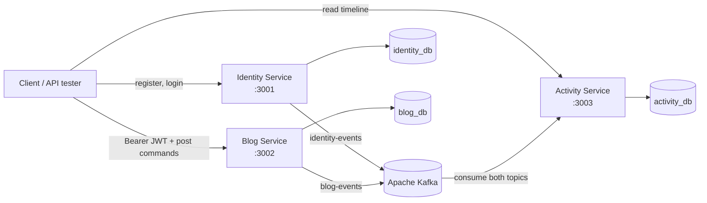
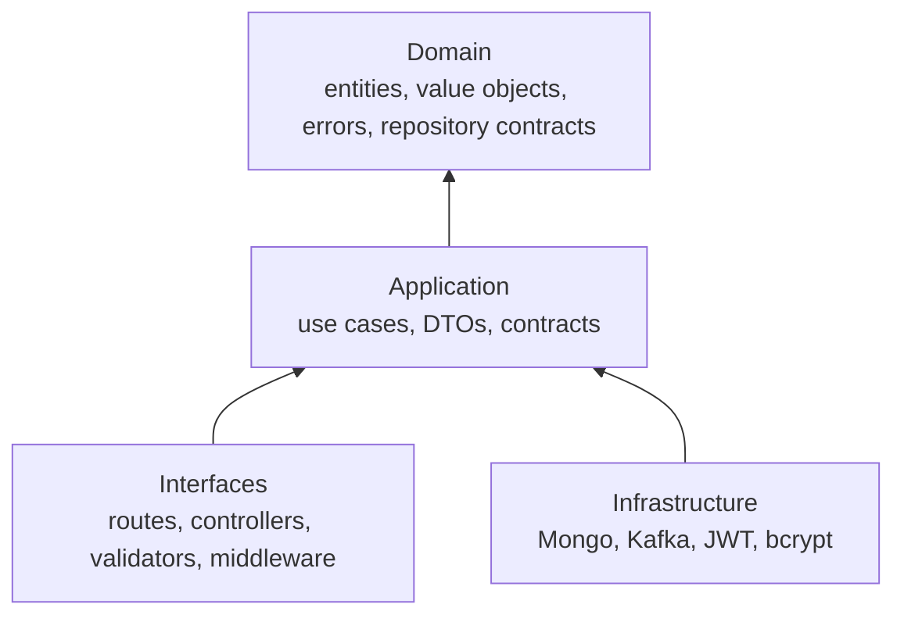
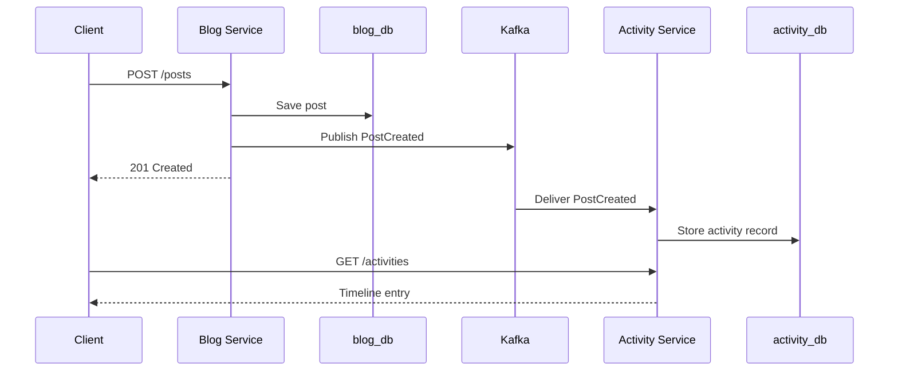

# MiniBlog

MiniBlog lets users create accounts, sign in, publish blog posts, and view an activity timeline. The repository shows how a request travels through HTTP, business rules, database persistence, and asynchronous Kafka events.

## Contents

- [Project idea](#project-idea)
- [System overview](#system-overview)
- [Services](#services)
- [Technology stack](#technology-stack)
- [Architecture and choices](#architecture-and-choices)
- [Event flow](#event-flow)
- [Quick start with Docker Compose](#quick-start-with-docker-compose)
- [Dockerfile design](#dockerfile-design)
- [API reference](#api-reference)
- [Development and testing](#development-and-testing)
- [Kubernetes](#kubernetes)
- [Production roadmap](#production-roadmap)

## Project idea

The system has three focused responsibilities:

1. **Identity** securely manages users, passwords, sessions, and JWTs.
2. **Blog** lets authenticated users create and manage their own posts.
3. **Activity** builds a timeline from events emitted by the other services.

This makes the project a hands-on introduction to REST APIs, password hashing, JWT authentication, MongoDB, Kafka, Docker, Kubernetes, and Clean Architecture.

## System overview



Every service owns its own data. No service reads another service’s MongoDB collection. Cross-service communication happens through HTTP at the edge or through Kafka events.

## Services

| Service          |   Port | Owns                                     | Main responsibility                                |
| ---------------- | -----: | ---------------------------------------- | -------------------------------------------------- |
| Identity Service | `3001` | Users, password hashes, refresh sessions | Register, login, logout, issue access tokens       |
| Blog Service     | `3002` | Posts                                    | Create, read, update, delete, authorize the author |
| Activity Service | `3003` | Activity projection                      | Consume events and expose a timeline               |

## Technology stack

| Technology                     | Purpose                                               |
| ------------------------------ | ----------------------------------------------------- |
| Node.js 20                     | Modern JavaScript runtime                             |
| ES modules                     | Standard `import` / `export` code organization        |
| Express                        | HTTP routes, middleware, JSON parsing, errors         |
| MongoDB + Mongoose             | Document persistence, schema definitions, indexes     |
| Apache Kafka (KRaft) + KafkaJS | Durable asynchronous event delivery                   |
| JWT + `jsonwebtoken`           | Short-lived stateless access tokens                   |
| `bcryptjs`                     | Secure, deliberately slow password hashing            |
| Docker / Docker Compose        | Repeatable local environment                          |
| Kubernetes manifests           | Deployments, services, probes, configuration, secrets |

## Architecture and choices

### Clean Architecture per service



| Layer          | Contains                                                     | Why it exists                                                           |
| -------------- | ------------------------------------------------------------ | ----------------------------------------------------------------------- |
| Domain         | Entities, value objects, domain errors, repository contracts | Business rules stay independent of Express, MongoDB, and Kafka.         |
| Application    | Use cases, DTOs, service contracts                           | Each action, such as `RegisterUser`, has one clear orchestration point. |
| Infrastructure | Mongo repositories, models, Kafka adapters, JWT, bcrypt      | Libraries can change without rewriting business rules.                  |
| Interfaces     | HTTP routes, controllers, validation, middleware             | Transport details remain at the system boundary.                        |

This is dependency inversion in practice. For example, `RegisterUser` requests a user repository, password service, and event publisher. At startup, the server injects MongoDB, bcrypt, and Kafka implementations. The use case never imports those libraries directly.

### Why three services?

- Identity has sensitive security data and rules that should stay isolated.
- Blog owns post content and author-ownership authorization.
- Activity is a read model; it does not need to synchronously call the other two services.

For a small commercial application, a modular monolith can be simpler and cheaper. Here the microservice split is deliberate: it exposes the trade-offs of service boundaries, asynchronous delivery, and operational complexity.

### Authentication design

```mermaid
sequenceDiagram
    participant C as Client
    participant I as Identity Service
    participant DB as identity_db
    participant B as Blog Service

    C->>I: POST /auth/login
    I->>DB: Find user; compare bcrypt hash
    I->>DB: Store refresh-token hash + expiry
    I-->>C: accessToken + refreshToken + safe user
    C->>B: POST /posts with Bearer accessToken
    B->>B: Verify JWT signature and expiry
    B-->>C: Authorized response
```

- Passwords are bcrypt hashes; plain passwords are never stored or returned.
- Access tokens are signed JWTs and are short-lived (default: 15 minutes).
- Refresh tokens are random secrets. MongoDB stores only a SHA-256 hash, so a database leak does not directly reveal usable refresh tokens.
- Identity signs and Blog verifies with the same `JWT_SECRET` in this learning project.

## Event flow



Activity is **eventually consistent**: it may take a brief moment for a new post to appear in the timeline. This is expected because Kafka processing is asynchronous. Each event includes a unique `eventId`, and Activity has a unique index for it, so redelivery does not create duplicate timeline items.

```json
{
  "eventId": "unique-id",
  "eventType": "PostCreated",
  "occurredAt": "2026-09-22T00:00:00.000Z",
  "source": "blog-service",
  "payload": {}
}
```

| Event                                             | Producer | Consumer |
| ------------------------------------------------- | -------- | -------- |
| `UserRegistered`, `UserLoggedIn`, `UserLoggedOut` | Identity | Activity |
| `PostCreated`, `PostUpdated`, `PostDeleted`       | Blog     | Activity |

## Repository structure

```text
blog_micro/
├── identity-service/            # Users, sessions, token issuance
│   ├── docs/                    # Beginner line-by-line source explanations
│   ├── src/domain/              # Business rules
│   ├── src/application/         # Use cases
│   ├── src/infrastructure/      # MongoDB, Kafka, JWT, bcrypt
│   └── src/interfaces/http/     # Express layer
├── blog-service/                # Post management
├── activity-service/            # Event-fed timeline
├── k8s/                         # Kubernetes manifests
├── docker-compose.yml           # Local full stack
└── README.md
```

## Quick start with Docker Compose

Docker Compose is the recommended run method. It starts the exact MongoDB and Kafka dependencies and gives containers the correct internal hostnames (`mongodb` and `kafka`).

### Prerequisites

- Docker Desktop running
- Docker Compose v2: `docker compose version`
- PowerShell on Windows, or a Bash-compatible shell on macOS/Linux

### 1. Create `.env`

The root `.env` is local and should not be committed. It needs a long JWT secret.

PowerShell:

```powershell
$jwtSecret = -join ((48..57) + (65..90) + (97..122) | Get-Random -Count 48 | ForEach-Object {[char]$_})
"JWT_SECRET=$jwtSecret" | Set-Content .env
```

Bash:

```bash
printf 'JWT_SECRET=%s\n' "$(openssl rand -base64 48)" > .env
```

Only `JWT_SECRET` is required in the root `.env`. Ports, database URIs, Kafka brokers, topics, and expiry values are configured in [docker-compose.yml](docker-compose.yml).

### 2. Build and run

```powershell
docker compose up --build -d
docker compose ps
```

`--build` updates service images after source changes. `-d` runs the stack in the background; omit it to watch all logs in the terminal.

### 3. Verify health

```powershell
Invoke-RestMethod http://localhost:3001/health
Invoke-RestMethod http://localhost:3002/health
Invoke-RestMethod http://localhost:3003/health
```

Each response should contain `status: ok`. If not, inspect logs:

```powershell
docker compose logs -f identity-service
docker compose logs -f blog-service
docker compose logs -f activity-service
```

### 4. Run the complete user journey

Register:

```powershell
$user = @{ email = 'ada@example.com'; name = 'Ada Lovelace'; password = 'secure-pass-123' } | ConvertTo-Json
Invoke-RestMethod -Method Post -Uri http://localhost:3001/auth/register -ContentType 'application/json' -Body $user
```

Log in and save the authorization header:

```powershell
$login = @{ email = 'ada@example.com'; password = 'secure-pass-123' } | ConvertTo-Json
$session = Invoke-RestMethod -Method Post -Uri http://localhost:3001/auth/login -ContentType 'application/json' -Body $login
$headers = @{ Authorization = "Bearer $($session.accessToken)" }
```

Create a post:

```powershell
$post = @{ title = 'Hello, MiniBlog'; content = 'My first event-driven post.' } | ConvertTo-Json
Invoke-RestMethod -Method Post -Uri http://localhost:3002/posts -Headers $headers -ContentType 'application/json' -Body $post
```

Read the event-generated timeline after a short delay:

```powershell
Invoke-RestMethod 'http://localhost:3003/activities?eventType=PostCreated'
```

### 5. Stop safely

```powershell
docker compose down
```

This preserves MongoDB and Kafka volumes. Use this command only when intentionally deleting all local data:

```powershell
docker compose down -v
```

## Dockerfile design

Every service has the same production-oriented Dockerfile; only `EXPOSE` changes by service.

```dockerfile
FROM node:20-alpine
WORKDIR /app
ENV NODE_ENV=production
COPY package*.json ./
RUN npm ci --omit=dev
COPY --chown=node:node src ./src
USER node
EXPOSE 3001
CMD ["npm", "start"]
```

| Instruction              | Reason                                                                     |
| ------------------------ | -------------------------------------------------------------------------- |
| `FROM node:20-alpine`    | Compact image with the project’s Node 20 runtime.                          |
| `WORKDIR /app`           | Predictable application directory.                                         |
| `NODE_ENV=production`    | Production-oriented runtime behavior.                                      |
| Copy manifests first     | Reuses the dependency cache when only application code changes.            |
| `npm ci --omit=dev`      | Installs exact lockfile versions, without development packages.            |
| `COPY --chown=node:node` | Source is owned by the runtime user.                                       |
| `USER node`              | Avoids running the service as root.                                        |
| `EXPOSE`                 | Documents an internal port; Compose/Kubernetes performs actual publishing. |
| JSON `CMD`               | Starts `npm` without shell parsing.                                        |

Manual image build:

```powershell
docker build -t miniblog/identity-service:local ./identity-service
```

Compose remains preferable for normal work because a standalone service also needs reachable MongoDB and Kafka.

## API reference

All services expose `GET /health`.

| Method   | Endpoint              | Authentication | Body / query                                     |
| -------- | --------------------- | -------------- | ------------------------------------------------ |
| `POST`   | `:3001/auth/register` | None           | `{ "email", "name", "password" }`                |
| `POST`   | `:3001/auth/login`    | None           | `{ "email", "password" }`                        |
| `POST`   | `:3001/auth/logout`   | None           | `{ "refreshToken" }`                             |
| `GET`    | `:3001/users/me`      | Bearer JWT     | —                                                |
| `POST`   | `:3002/posts`         | Bearer JWT     | `{ "title", "content" }`                         |
| `GET`    | `:3002/posts`         | None           | `page`, `limit`, optional `authorId`             |
| `GET`    | `:3002/posts/:id`     | None           | —                                                |
| `PATCH`  | `:3002/posts/:id`     | Author JWT     | `{ "title"?, "content"? }`                       |
| `DELETE` | `:3002/posts/:id`     | Author JWT     | —                                                |
| `GET`    | `:3003/activities`    | None           | `page`, `limit`, `userId`, `action`, `eventType` |

Responses never return password hashes. Login returns a safe user object plus access and refresh tokens.

## Development and testing

For direct Node.js development, install dependencies and start each service in a separate terminal. MongoDB and Kafka must still be running and service environment variables must point to host-reachable endpoints.

```powershell
cd identity-service; npm ci; npm run dev
cd blog-service; npm ci; npm run dev
cd activity-service; npm ci; npm run dev
```

Keep Identity and Blog on the same `JWT_SECRET`. Inside Docker, infrastructure is named `mongodb` and `kafka`; a host-run process requires host-reachable addresses instead.

Run available automated tests:

```powershell
cd blog-service; npm test
cd activity-service; npm test
```

Useful diagnostics:

```powershell
docker compose ps
docker compose logs -f activity-service
docker compose up --build -d identity-service
```
